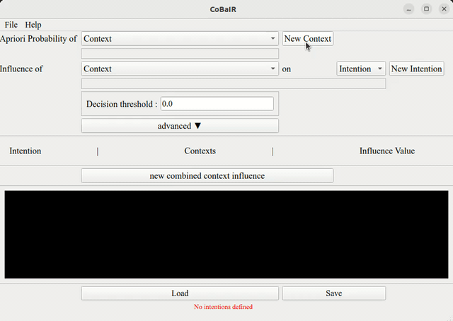
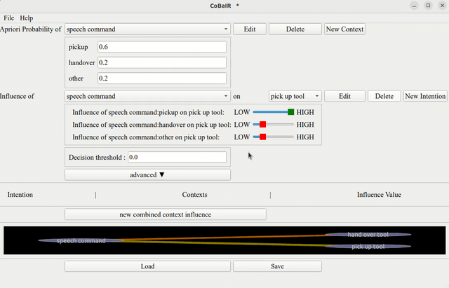

# Specific Scenario Analysis
The CoBaIR framework is designed to interpret human intentions within diverse settings, assigning probabilities to these intentions based on the contextual information provided in scenarios like the one described in `small_example.yml`.

### 1. Context Setup:
- **Speech Commands**: Consider a person issuing the speech command "pickup".
- **Human Holding Object**: This individual is not holding any object (false).
- **Human Activity**: The person is engaged in work (working).

### 2. Decision Threshold:
- The system's decision threshold is set at 0.8. This means that for any intention to be recognized as valid, the associated probability must exceed this threshold.

### 3. Calculating Intentions:
- **Pick Up Tool Intention**:
    - The command "pickup" leads to a high influence score of 5 for the intention to "pick up tool".
    - The absence of an object in the person's hand contributes a score of 4 to this intention.
    - Being engaged in work adds a score of 3.
    - These combined factors substantially increase the likelihood of the "pick up tool" intention.
- **Hand Over Tool Intention**:
    - The "pickup" command contributes a score of 0 to this intention.
    - The fact that the person is not holding an object contributes a score of 4.
    - The work activity adds a lower score of 1.
    - Overall, this intention is less likely compared to "pick up tool" due to lesser influence from the speech command.

### 4. Outcome:
- Considering the contexts and their impact, the system deduces that the person most likely intends to "pick up tool", with a probability surpassing the 0.8 threshold.
- Consequently, the system would likely initiate actions or responses in line with facilitating tool pickup.

This example shows how the CoBaIR can assess different contextual factors and their influence on possible intentions, thereby interpreting and acting upon human intentions in a dynamic environment.

# Configuring CoBaIR Settings

## **Apriori Probabilities**

Apriori probabilities are initial probabilities based on prior knowledge or assumptions, indicating the likelihood of context states.

### Setting Apriori Probabilities
In the "Apriori Probability of Context" section:
1. Select a context or create a new one.
2. Assign probabilities ensuring they sum to 1.

## **Influence Values**

These values indicate how much a context influences a particular intention.

### Setting Influence Values
In the "Influence of Context on Intention" area:
1. Choose a context and an intention.
2. Use a slider to assign an influence value on a 0-5 scale.

## **Decision Threshold**

A pre-set level that an intention must meet or exceed to be selected.

### Importance of Setting It
It ensures the system acts on intentions with a certain confidence level, reducing the chance of incorrect actions based on low-probability guesses.

### How to Set
In the 'Decision Threshold' setting:
1. Enter a numeric value.
2. Adjust to balance responsiveness and accuracy. Default: 0.8 (80% probability).

## **Combined Context Influence**

In complex decision-making circumstances, the end result is shaped by the convergence of numerous contexts rather than by a single context acting in isolation. To effectively simulate the complexity of interactions in the real world, the Combined Context Influence is required. In order to enable the system create complex interpretations and predictions, this synthesis of contexts offers a diverse perspective.

### Configuring Combined Context Influence

In the 'new combined context influence' setting.
1. Input pairs of contexts that interact with each other.
2. Assign a numerical value (influence value) to these pairs to indicate their combined effect on an intention.

## **Graphical Representation**

- **Visual Overview**: 
  - The graph provides a visual representation of how different contexts and intentions are interconnected.

- **Context Nodes**: 
  - Each node represents a context or intention. Context nodes are linked to intentions they influence.

- **Edges**: 
  - Edges between nodes show the relationships and their strength, based on the influence values set in the previous steps.

### Interacting with the Graph

- **Expanding Contexts**: 
  - Click on context nodes to expand and see detailed relationships between contexts and intentions. Upon clicking, a context node unfolds to reveal specific instantiations, each connected to relevant intentions.

- **Adjusting Views**: 
  - The graph can be zoomed in or out for a more detailed or broader view, respectively.

- **Dynamic Interaction**: 
  - As you adjust influence values or apriori probabilities in the settings, these changes are reflected in the graph in real-time, offering immediate visual feedback.

This graphical representation is allowing for a clear and intuitive understanding of how various contexts and intentions are interrelated. It aids in verifying and adjusting configurations, ensuring that the system accurately interprets intentions based on the given context.
