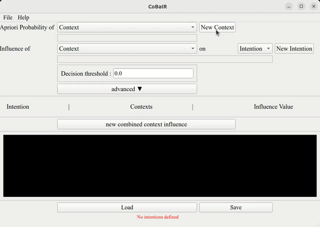
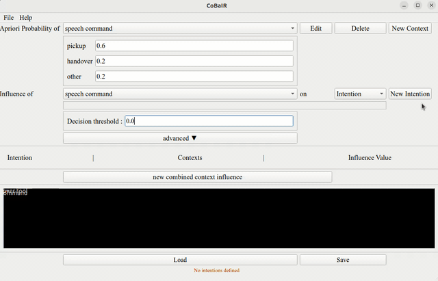
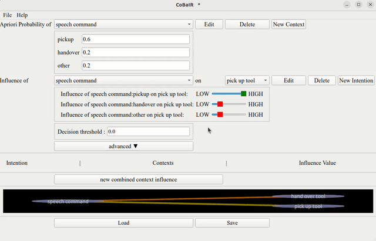
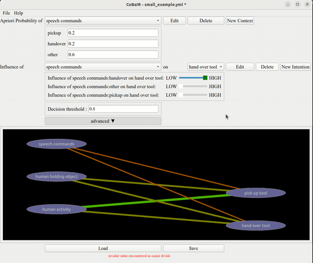
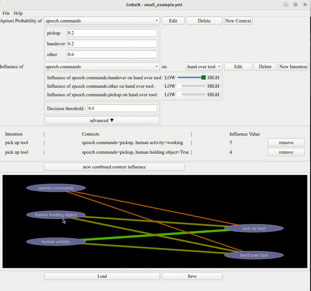

# Purpose of CoBaIR
The CoBaIR framework is designed to interpret human intentions within diverse settings, assigning probabilities to these intentions based on the contextual information provided in multimodal scenarios.

# Prerequisites
Before starting to design a scenario with CoBaIR you need to understand some basics.

## Intentions
Intentions denote what a human in an HRI scenario wants to do in a certain situation.
An intention is a binary value e.g. `repair pipe` that can either be present or not. Only one intention can be present at a time.

## Context
Every perceivable aspect of the scenario is considered to be context in CoBaIR.
Context can have multiple discrete instantiations e.g. `weather:sunny|cloudy|raining`.
If context values are continuous, discretizer functions can be used to create discrete values.

# Configuring a CoBaIR Scenario with the GUI

## Apriori Probabilities

Apriori probabilities are initial probabilities based on prior knowledge or assumptions, indicating the likelihood of context states. These apriori probabilities will be used during inference if a specific context cannot be observed. In this case it assumed that the instantiations of the context occur with the given probabilities.  

### Setting Apriori Probabilities
In the `Apriori Probability of Context`` section:
1. Select a context or create a new one.
2. Assign probabilities ensuring they sum to 1.

## Influence Values

These values indicate how much a context influences a particular intention.

### Setting Influence Values
In the `Influence of Context on Intention` area:
1. Choose a context and an intention.
2. Use a slider to assign an influence value on a 0-5 scale.

## Decision Threshold

A pre-set level that an intention must meet or exceed to be selected.

### Importance of Setting It
It ensures the system acts on intentions with a certain confidence level, reducing the chance of incorrect actions based on low-probability guesses.

### How to Set
In the `Decision threshold` setting:
1. Enter a numeric value.
2. Adjust to balance responsiveness and accuracy. 

## Combined Context Influence

In complex decision-making circumstances, the end result is shaped by the interaction of numerous contexts rather than by a single context in isolation. To effectively simulate the complexity in the real world, the Combined Context Influence is required. 

### Configuring Combined Context Influence

In the `new combined context influence` setting.
1. Input pairs of contexts that interact with each other.
2. Assign a numerical value (influence value) to these pairs to indicate their combined effect on an intention.

## Graphical Representation

- **Visual Overview**: 
  - The graph provides a visual representation of how different contexts and intentions are interconnected.

- **Nodes**: 
  - Each node represents a context or intention. Context is displayed on the left side and intentions are displayed on the right side. Context nodes are linked to intentions they influence.

- **Edges**: 
  - Edges between nodes show the relationships and their strength, based on the influence values set in the previous steps. The higher the influence, the thicker and greener the edge.

### Interacting with the Graph

- **Expanding Contexts**: 
  - Upon clicking, a context node unfolds to reveal specific instantiations, each connected to relevant intentions.

- **Adjusting Views**: 
  - The graph can be zoomed in or out for a more detailed or broader view, respectively.

- **Dynamic Interaction**: 
  - As you adjust influence values or apriori probabilities in the settings, these changes are reflected in the graph in real-time, offering immediate visual feedback.

This graphical representation is allowing for a clear and intuitive understanding of how various contexts and intentions are interrelated. It aids in verifying and adjusting configurations, ensuring that the system accurately interprets intentions based on the given context.

# Example Scenario
Here we describe an example scenario which can be loaded from the file `small_example.yml`. We have a very small scenario where a human can be assisted by a robot. In this scenario the human either wants the robot to pick up a tool or hand over a tool. What the robot can perceive is if the human is holding an object, the human activity and a speech command from the human.

### 1. Context Setup:
- **speech commands**: The context `speech commands` has the following three instantiations: `pickup`, `hand over`, `other`
- **human holding object**: The context Human Holding Object can either be `True` or `False`
- **human activity**: The context `human activity` can either be `working` or `idle`

### 2. Intention Setup:
In this scenario we only have the intentions `hand over tool` and `pick up tool`.

### 3. Setting Values:
- **Apriori Probabilities for Context**
  - To set the apriori probabilities for the context instantiations, we have to ask ourselves *"How likely is it that this instantiation occurs"*. If we have no knowledge about that it is a good fit to just equally distribute the probability over all instantiations.
- **Influence Values for Context-Intention pairs**
  - For every Context-Intention pair you need to ask yourselves *"How much influence has this context instantiation on this intention"*.
- **Decision Threshold:**
  - For our scenario we set the decision threshold to 0.8. This means that for any intention to be recognized as valid, the associated probability must exceed this threshold. With 80% we assure that the system must be quite confident for the inferred intention.
- **Cobined Context Influence**
  - Most of the cases can be covered by just setting the influence values for all Context-Intention pairs. But in some cases there is the need to give a very specific influence to the combined occurrence of two or more contexts. In this example we decided to give the case where the human is `working` while giving the `speech command` `pick up tool` a extra high influence to make sure that in this case the robot is very certain that it needs to assist the human to pick up the tool.

### 4. Outcome:
To test the inference on your config you can use the script `small_example_from_yml.py` in an interactive Jupyter Shell. Try to change the evidence to see if your configuration describes the scenario as expected.

This example shows how the CoBaIR can assess different contextual factors and their influence on possible intentions, thereby interpreting and acting upon human intentions in a dynamic environment.